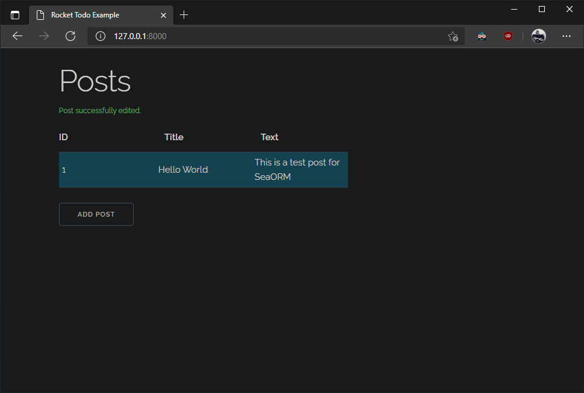

# JiraScore

## Prepare

MySql
Rust

## 
1. Execute `cargo run` to start the server

1. Visit [localhost:8000](http://localhost:8000) in browser after seeing the `🚀 Rocket has launched from http://localhost:8000` line
